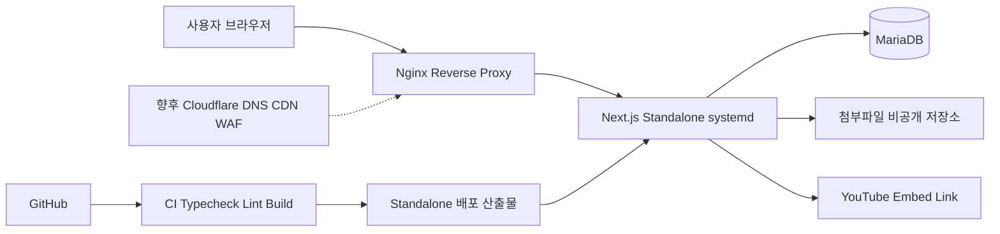
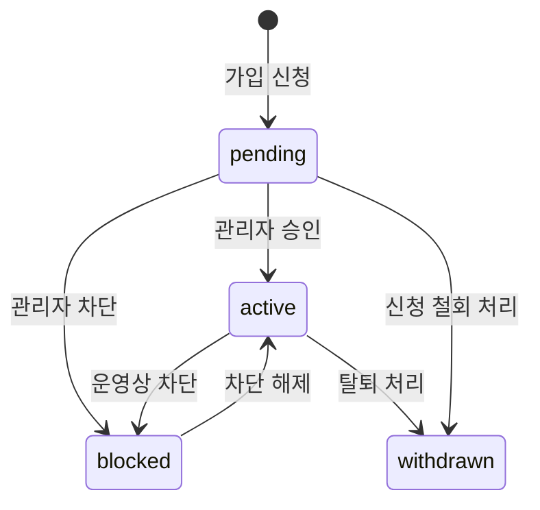
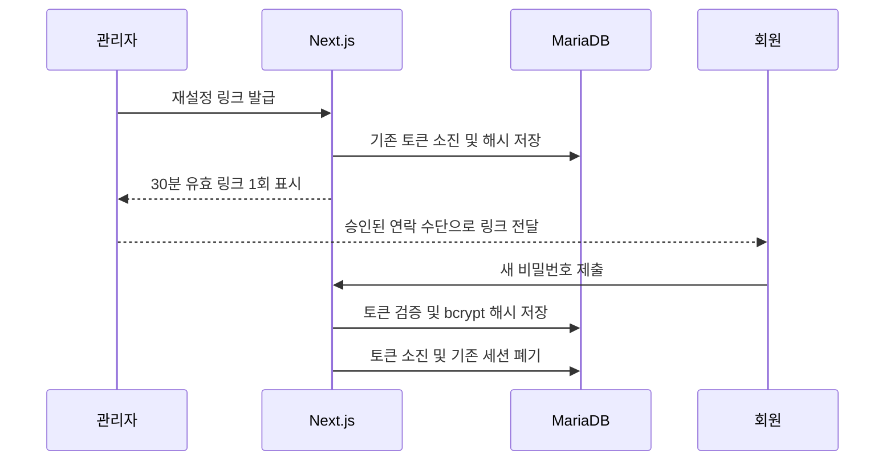

# 시스템 설계서

## 1. 설계 목표

- 운영비를 낮추고 단일 iwinv VPS에서 운영 가능한 구조
- 운영 서버와 분리된 로컬 개발·검증
- 서버에서 소스를 빌드하지 않고 검증된 standalone 산출물 배포
- 회원·게시판·번역 데이터를 정적 화면 코드와 분리
- 향후 Cloudflare와 외부 파일 저장소를 단계적으로 연결할 수 있는 구조

## 2. 전체 구성

로컬 환경에서는 Cloudflare와 Nginx 없이 `127.0.0.1`의 Next.js가 로컬
MariaDB와 마이그레이션된 첨부파일을 사용한다. 운영 전환 전까지 운영 서버에는
쓰기 작업을 하지 않는다.

## 3. 애플리케이션 구조

| 영역 | 위치 | 책임 |
|---|---|---|
| 공개 페이지 | `app/[locale]` | 언어별 페이지와 기존 UI 제공 |
| 서버 액션 | 각 기능의 `actions.ts` | 입력 검증, 인증 확인, 저장 요청 |
| 인증 | `lib/auth.ts` | 로그인, 세션, 권한 판정 |
| 회원 도메인 | `lib/members.ts` | 가입, 회원 조회·변경, 재설정, 감사 로그 |
| 게시판 도메인 | `lib/content.ts`, `lib/admin.ts`, `lib/admin-content.ts`, `lib/admin-boards.ts` | 조회, 게시물·파일 관리, 게시판 권한 |
| 강의 도메인 | `lib/lectures.ts` | 강의 분류·과목·차시 조회 및 관리 |
| 관리 감사 | `lib/admin-audit.ts` | 콘텐츠 운영 변경 이력 |
| 다국어 | `lib/i18n-server.ts`, `lib/language-admin.ts` | 언어·번역 조회, fallback, 일괄 관리 |
| DB 연결 | `lib/db.ts` | 연결 풀과 트랜잭션 |
| 마이그레이션 | `database/migrations` | 재현 가능한 스키마 변경 |

Server Component에서 DB를 조회하고, 브라우저 상호작용이 필요한 폼만 Client
Component로 제한한다. DB 변경은 Server Action을 통하며 입력은 Zod로 검증한다.

## 4. 인증과 세션 설계

1. 아이디 또는 이메일을 소문자 기준으로 조회한다.
2. 존재하지 않는 계정도 더미 bcrypt 비교를 실행해 응답 시간 차이를 줄인다.
3. 레거시 MySQL 4.1 해시는 상수 시간 비교로 검증하고 성공 즉시 bcrypt cost 12로 전환한다.
4. 15분 이내 실패가 5회 이상이면 로그인을 제한한다.
5. `active` 회원만 로그인할 수 있다.
6. 32바이트 난수 세션 토큰은 브라우저 쿠키에만 전달하고 DB에는 SHA-256 해시만 저장한다.
7. 세션 유효기간은 14일이며 HttpOnly·SameSite=Lax를 적용한다.
8. 차단·탈퇴 또는 비밀번호 변경 시 해당 사용자의 모든 세션을 폐기한다.

## 5. 회원 생명주기

- 신규 가입 시 `member` 역할을 미리 부여하지만 `pending` 상태에서는 로그인할 수 없다.
- 관리자는 `member`, `editor`, `admin` 역할을 조합할 수 있다.
- 자기 계정의 활성 상태와 관리자 역할은 스스로 해제할 수 없다.
- 마지막 활성 관리자는 차단·탈퇴하거나 관리자 역할을 제거할 수 없다.
- 변경 전후 상태와 역할은 `user_audit_logs`에 기록한다.

## 6. 비밀번호 재설정

관리자는 회원 비밀번호를 조회하거나 직접 알 수 없다. 메일 서비스가 연결되기
전에는 발급 링크를 별도의 승인된 채널로 전달한다. 링크 원문은 DB에 저장하지
않고 SHA-256 해시만 저장한다.

## 7. 다국어 설계

- URL 첫 경로를 언어 코드로 사용한다: `/ko`, `/en`, `/zh-CN`.
- 활성 언어 목록은 `locales`에서 읽어 메뉴를 생성한다.
- 화면 문구는 `site_translations(locale_code, message_key)`로 관리한다.
- 조회 우선순위는 `요청 언어 → fallback_code(영어) → 한국어 → 코드 기본값`이다.
- `catalogKeys`는 번역 가능한 전체 키 목록이다.
- JSON 일괄 등록은 하나의 DB 트랜잭션에서 처리해 일부 언어만 저장되는 상태를 방지한다.

## 8. 게시판과 첨부파일

- 게시물 공통 정보와 언어별 제목·본문을 `posts`, `post_translations`로 분리한다.
- 역할별 권한은 `board_role_permissions`에서 결정한다.
- 레거시 HTML은 서버에서 정화한 뒤 렌더링한다.
- 첨부파일 원본명은 표시 용도로만 사용하며 실제 저장 경로는 내부 키를 사용한다.
- 다운로드 API가 로그인 세션과 게시판 다운로드 권한을 모두 확인한 후 파일을 제공한다.
- 자료 게시판 목록은 첨부파일명과 크기를 함께 조회해 바로 다운로드할 수 있게 하되,
  비회원에게는 파일 URL 대신 로그인 화면 링크를 제공한다. API 주소를 직접 요청한
  비회원에게도 파일을 제공하지 않고 `401`을 반환한다.
- 신규 업로드는 허용 확장자, 게시판별 개수·용량, 20MB 요청 상한을 검사하고 실행 파일을 차단한다.
- 파일은 `UPLOAD_ROOT/admin/{postPublicId}` 아래의 추측하기 어려운 키로 저장한다.

## 9. 강의 관리

- `lecture_categories` → `lecture_courses` → `lecture_lessons` 구조를 사용한다.
- 분류와 과목명은 언어별 번역 테이블로 분리하고 요청 언어, 영어, 한국어 순으로 대체한다.
- 과목은 공식 YouTube 재생목록 ID를 가지며 차시는 필요할 때 개별 영상 ID로 덮어쓸 수 있다.
- `is_visible`은 차시 목록 노출, `is_available`은 재생 가능 여부를 제어한다.
- 사용자 URL `/{locale}/lectures/{courseCode}`는 기존 구조를 유지한다.

## 10. 보안 설계

| 계층 | 적용 사항 |
|---|---|
| Cloudflare | DNS 프록시, 관리·로그인 경로 rate limit, 관리형 WAF, DDoS 보호 |
| Nginx | TLS 종료, 요청 크기 제한, 보안 헤더, Next.js 역방향 프록시 |
| 애플리케이션 | 서버 액션 권한 재검사, Zod 검증, bcrypt, 세션 폐기, HTML 정화 |
| 데이터베이스 | 전용 최소권한 계정, 외부 직접 접근 차단, prepared statement, 감사 로그 |
| 파일 | 웹 루트 밖 저장, 추측 불가능한 키, 다운로드 권한 검사, 정기 백업 |

운영 환경에서는 `SESSION_COOKIE_SECURE=true`를 설정하고 비밀값은 systemd가 읽는
서버 전용 환경 파일로 주입한다.

## 11. 빌드와 배포

1. GitHub 브랜치에서 변경사항을 검토한다.
2. Node.js 24, MariaDB 11.4 기준으로 typecheck, lint, build를 실행한다.
3. DB 백업 후 아직 적용되지 않은 번호의 마이그레이션을 순서대로 적용한다.
4. `.next/standalone`, `.next/static`, `public`을 배포한다.
5. systemd `fchinac` 서비스를 재시작한다.
6. 로그인·게시판·첨부파일·관리자 기능을 smoke test한다.
7. 이상 발생 시 이전 앱 산출물과 DB 백업으로 원복한다.

## 12. 현재 제약과 후속 설계

- 이메일 발송 서비스가 없어 비밀번호 재설정 링크를 관리자가 전달한다.
- 헬스체크와 로컬 백업 자동화는 구성됐으며 외부 백업과 복원 리허설이 필요하다.
- 회원별 강의 진도와 개인별 다운로드 이력은 아직 없다.
- 개인정보 처리방침과 보유 기간은 운영 주체 검토 후 확정해야 한다.
